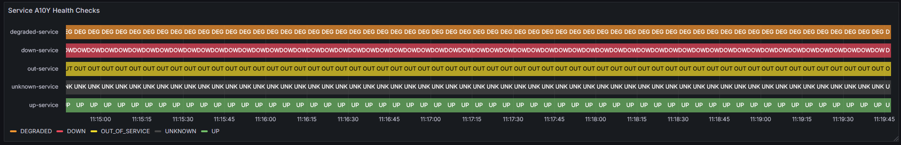

# a10y-healthcheck-reporter

An example panel that can be created using the metrics produced by this service.


## Goals
A10Y service that defines its result type contract via `protobuf` to enable use with multiple languages.

- [ ] add `protobuf` definitions for `HealthCheckResult`, and `HealthCheck`.
- [ ] add support for grpc healthchecks.

# Configuration

### Metric Meter

You can use `GAUGE_MEASUREMENT_NAME` (default: `a10y.status_code`) to set the name of the measurement that will be recorded.

### HealthCheck endpoints

expose an environment variable `A10Y_HEALTH_CHECKS` (default: `[]`) with the following schema:

#### Schema
```json
[{
  "url": "string",
  "metadata": {
    "component": "string",
    "datacenter": "string",
    "environment": "string",
    "feature:": "string",
    "system": "string",
    "team": "string",
  }
}]
```

#### Example
```json
[{
  "url": "http://localhost:3001/_manage/health",
  "metadata": {
    "component": "testing",
    "datacenter": "local",
    "environment": "local",
    "feature": "up_service",
    "system": "personal",
    "team": "pitoniak32",
  }
},
{
  "url": "http://localhost:3002/_manage/health",
  "metadata": {
    "component": "testing",
    "datacenter": "local",
    "environment": "local",
    "feature": "down_service",
    "system": "personal",
    "team": "pitoniak32",
  }
}]
```

# Try it out Locally

```sh
# start up the test service that healthchecks will be performed on
cargo run --example test_service
```

In a separate terminal
```sh
# start up the debug otel collector
docker compose -f docker-compose-debug.yml up -d 

# run the healthcheck reporter
cargo run
```